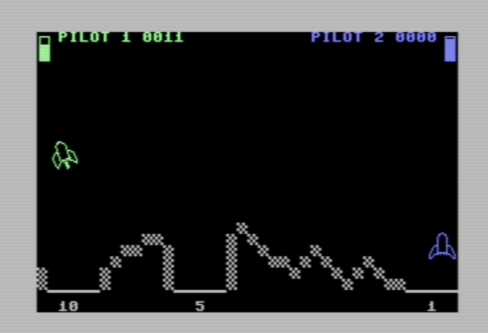

# rocket-lander-c64
My first assembly language game

## Why I wrote this
I decided I wanted to learn 8-bit 6502 assembly language game programming.
After watching many youtube videos and reading many online resources and books, and reviewing my commodore 64 programmer's reference guide that I bought way back in 1984... I was ready to start writting some code!

This code is written solely for the purpose of my own education path and shared for anyone to do pretty much anything they want with it.
My goal was to learn how to animate sprites around the screen, accept joystick input, make sounds, show status to user, keep score in binary coded decimal, etc. etc.

I wrote this using Turbo Macro Pro in emulator 40 column screen! Using both Vice on a Macbook Pro and Retro Games excellent C64 emulators.

The .d64 file contains the object code in rocketlnd.prg and the latest TMP assembly souce in 2ships13.prg.

The src directory contains a text export of the source from TMP.

## Screen Caps

## Gameplay
The game is two player only, when BOTH players press up and the same time on their joystick a new round will start.  Both ships appear in the same place so the green one obscures the blue ship behind it for a 3-4 seconds pause before the round starts with both ships suddenly moving to the right and experiencing gravity.

Pressing fire button engages the thrust which counters your falling if the joystick is centered and can increase or decrease sideways movement by moving your joystick right or left while thrusting.

If you hit either side of the screen your horizontal movement will stop.  To stop moving horizontally before you hit the side you need to thrust the opposite way to slow to a halt, this is what makes the other pads more challenging than the right one which only requires hitting the right wall before you hit the bottom.

Hitting the 'rocks' below will cause the rocket to bounce upwards and cost you one point per hit.  To land you need to hit one of the landing pads with no side to side movement.  Vertical speed doesn't matter, hit the pad as hard as you want, as long as you are not moving to the side you will land and collect the points.

Once both players land the round is over the start screen instructions are displayed directing you to  both press up when ready for another round and chance to accumulate more points than your opponent.  If you want to start each player over with 0 points both players must press down at the same time instead of up.

## How to run it
You need a commodore 64 emulator and two emulated 'joysticks' to run and play the game but this is easily done if you are reading this page on a device with a keyboard.

Of course you can run this on any c64 emulator or even a real c64 (sadly I haven't tried because I no longer have one) but I assume if you have either you already know how to run this so including these instructions for anyone running across this and wanting to give it a go.

###  Steps to run on online emulator
1. What are Online Emumlators?
There are a few online c64 emulators that run in a web browser for free in trade for your attention to some ads.  Once you get the emulator confured and running a game you can go full screen. Search the web for "online c64 emulator" and try one.
They typically have a 'screen' in which the emulation runs, some buttons for important keys, a way to setup the the joysticks, and a rectangle into which you can drag and drop c64 object files.  

1. Download and run Rocket Lander
Download the rocketlnd.prg file from this repository and save in in Downloads or wherever you want to save it.  Then drag the file into the appropriate location on the online c64 emulator.  These things are usually smart enough to not only load the program automatically but even type the `SYS 49152` command for you!
If all goes well you should see a mostly black and while screen similar to the screencaps below.

1. The game is loaded at address 49152 the typical way to run the program after loading from a disk, or the emulated equivilent of loading from a disk is to type the `SYS 49152` command and hit return, so on a real c64 or some emulators this may be required to actually start the program.

1. Setup Joysticks
Don't forget you need TWO joystick configuration, I used `Joystick Keyboard1 -> Player2` which I saw on all three of the top emulators on my search.  Note the keys that each player needs to use for up, left, right, down, and fire/select and test things out before trying to go full screen.  You can play yourself by pressing both players 'up' key to start, then during the pause situate yourself for whichever player you prefer and allow the other player to bounce along and loose and regain one point every round.

## Updates
I don't really intend to make any, the goal was to learn some skills and I learned some skills. I have moved on to another project which is more challenging.
You are free of course to modify or improve this if you desire.

## Bugs
You bet, I'm pretty sure there is a spot you can land on the 10 point pad and get 0 points, or maybe only 5.  I think I hit a rock once and didn't loose a point.